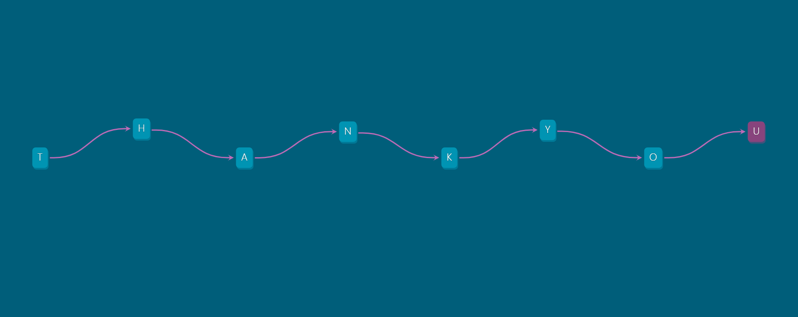

## 💌 The DAG That Says THANK YOU

This dbt project spells out a thank-you message using model dependencies, just for fun and to learn some dbt basics. Here's the DAG:

> Full disclosure: this was built with copious assistance from my fave ChatGPT.  
> – Astrid
